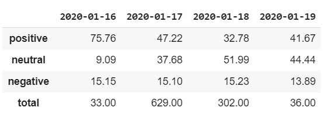

<!--title={Generating tweets for produce_dataframe()}-->

<!--concepts={dataframes.mdx}-->

In order to add items to the dataframe, we first need to create dataframe. We can use the `pandas` library to create a dataframe. 

The function we want to use is `pandas.Dataframe(arguments)`. Use the argument: 

* `index` to set the rownames to 'positive', 'neutral', and 'negative.'
* `columns` to set the columnnames to `date` and `sentiment`

If you run your code before inserting any data, your graph should look like this: 

