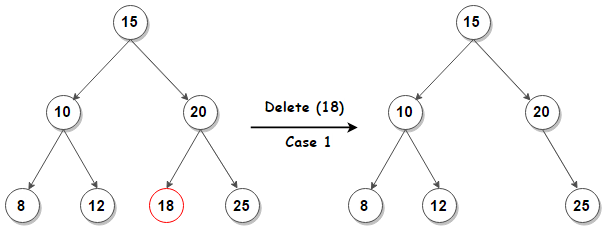

<!--title={BSTDelete() I}-->

<!--badges={Algorithms:15,Python:5}-->

<!--concepts={Binary Search Tree Delete}-->

The last fundamental function letting us interact with BSTs is `BSTDelete`, which will let us remove unwanted nodes from our tree. `BSTDelete` is arguably the most complicated of the BST functions we have learned so far because we have to fix the tree once we remove a node.

##### Deleting a BST Node:

When deleting a BST node, there are **two main cases**:

<<<<<<< Updated upstream:Data-Structures-and-Algos-Topic/Module2-Intermediate-Data-Structures/activities/Act2_Trees/cards/6.md
* **Leaf/1 Child Case:** The easier of the two cases is when the node we want to delete is a leaf in the BST or a node with only one child. Since a leaf does not have any children, deleting it from a BST leaves us with a proper BST, meaning we do not have to change the structure of the tree and can simply remove the node. Also, if a node we want to delete only has one child, we can just delete that node and place its child where it used to be. Here is an example of the former:      
=======
* **Leaf/1 Child Case:** The easier of the two cases is when the node we want to delete is either a leaf in the BST or a node with only one child. Since a leaf has no children, deleting it from a BST leaves us with a proper BST, meaning we don't have to change the tree's structure and can simply remove the node. Also, if a node we want to delete only has one child, we can just delete that node and replace it with its child. Here is an example of the former:
>>>>>>> Stashed changes:Data-Structures-and-Algos-Topic/Module2-Intermediate-Data-Structures/activities/Act2_Trees/6.md

   

* **2 Child Case**: The more challenging case occurs when you want to delete an internal node in the BST, or a node with two children. If you simply deleted the node, you'd lose the children. Therefore, when an internal node is deleted, it must be replaced with the maximum node of the deleted node's left subtree or minimum node of the deleted node's right subtree in order to still be considered a BST. Note that your code implementation determines the preference between these two options.  Here is an illustration that should help your understanding:

  

Here, we chose to delete `20` from the tree and picked its in-order predecessor node as its replacement. The in-order predecessor node is the maximum value of a node's left subtree; in the above case, that is `19`. Similarly, we could've also used the in-order *successor* node, which is the *minimum* value of a node's *right* sub-tree. If we had gone that direction, we would have chosen `30` as the replacement for `20` in our example instead. 

Note that the process for deleting a child with two nodes is the same for **any** node, even the root! If we had decided to remove `15` from our tree above and still use the in-order predecessor node as our replacement, we would have picked `12` to be in its place. We would have chosen `16` if we picked the successor node.