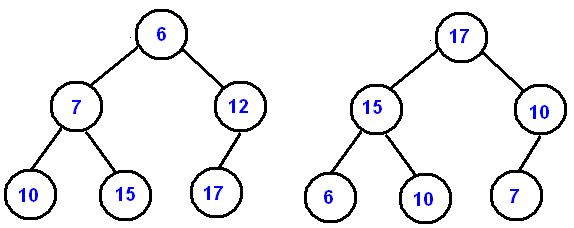
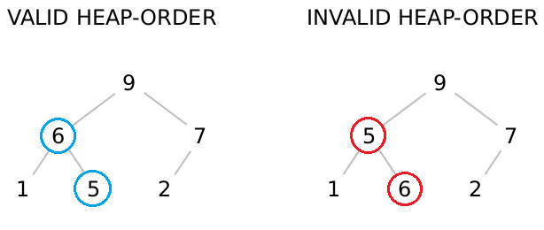

<!--title={Binary Heaps}-->

<!--badges={Algorithms:5,Python:5}-->

<!--concepts={Binary Search Tree Heap}-->

#### Binary Heaps:

One interesting type of tree data structure is a **Binary Heap**, which is a type of binary tree. A binary tree can only have 0, 1, or 2 children. Binary Heaps have the following properties:

- Each node must be filled by the number of children, except the last level of the node if there is no children(object) available.
- New children must be added to the left-most available position.
- It is either an instance of a Min Heap or Max Heap.
- Binary heap is a complete binary tree.

A **Min Heap** is a heap where the root has <u>the smallest key</u> and the keys on the nodes get <u>larger</u> as you go down the tree. 

A **Max Heap** is a heap where the root has <u>the largest key</u> and the keys on the nodes get <u>smaller</u> as you go down the tree.

Examples of **Binary Heaps**:



The image on the left is an example of a **Min Heap**. The image on the right is an example of a **Max Heap**.

#### Valid vs. Invalid Max Heaps:



The right tree is invalid heap-order, because 5 has a child 6, which is not the correct heap order. Left and right value of the subtrees must be less than or equal to the value at the parental node. 


One useful attribute of **Binary Heaps** is the ability to find the min/max of the tree in **O(1)** time because the root of a **Min Heap** is the min of the data and the root of a **Max Heap** is the max of the data.


### Binary Heap Implementation:

Given a list of elements, we want to be able to convert it into a Binary Heap. Below is an example of a list of numbers represented by a Min Heap:


Above figure represents the binary heap implementation in order of a Min Heap. You can read the figure by top level from left to right. When you represent the number in the list of array, you must put root at index 1 position, because it is easy to find parent and child node. 

Now to view this programmatically, we will define a Binary Heap implementation representing a Min Heap. We will begin our implementation of a binary heap with the constructor. Since <u>the entire binary heap can be represented by a single list</u>, all the constructor (`__init__`) will do is initialize the list and an attribute `currentSize` to keep track of the current size of the heap. You will notice that an empty binary heap has a single zero as the first element of `heapList` and that this zero is not used, but is there so that simple integer division can be used in later methods.

```python
class BinHeap:
    def __init__(self):
        self.heapList = [0]
        self.currentSize = 0 
```


