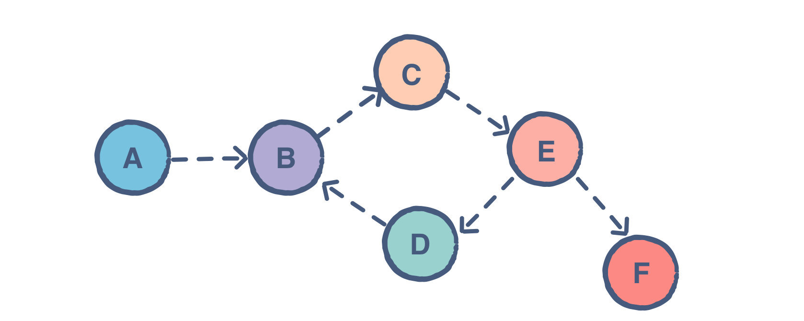

<!--title={Directed Graphs}-->

<!--badges={Algorithms:5,Python:10}-->

<!--concepts={directedGraphs}-->

## Directed Graphs

Directed graphs have edges with direction. The edges indicate a *one-way* relationship, in that each edge can only be traversed in a single direction. This figure below shows a simple directed graph. Edges are usually represented by arrows pointing in the direction the graph can be traversed.


> The graph can be traversed from vertex **A** to **B**, but not in the opposite direction.




> Directed Graph


### Python Code:

```python
import networkx as nx
import matplotlib.pyplot as plt

G = nx.DiGraph() #Create an empty directed graph structure with no nodes or edges.
G.add_edges_from(
    [('A','B'),('B','C'),('C','D'),('D','E')]) #add edges A to B, B to C, C to D, D to E
#Because it's a directed graph, the order matters. ('B','A') will create a edge from B to A. 

#Set the values to determine the nodes' color.
val_map = {'A': 1.0,
           'D': 0.5714285714285714,
           'H': 0.0}

values = [val_map.get(node, 0.25) for node in G.nodes()]


```

> Here, we inputted the number of edges and stored their values into val_map (a dictionary). We then used the values in val_map to print out the visualization of the graph by making a values list and used the get()* function.

> *A list is created by placing all the items (elements) inside square brackets separated by commas. It can have any number of items and they may be of different types (integer, float, string, and so on).

> *The get() method  is used with a dictionary. It returns the value for the specified key if the key is in the dictionary.

```python
#Set edge colors and specify the edges you want here
red_edges = [('A', 'B'), ('B', 'C'),('C','D'),('D','E')]
edge_colours = ['black' if not edge in red_edges else 'red'
                for edge in G.edges()]
black_edges = [edge for edge in G.edges() if edge not in red_edges]

#Need to create a layout when doing
#Separate calls to draw nodes and edges
pos = nx.spring_layout(G)
#draw the nodes of G
nx.draw_networkx_nodes(G, pos, cmap=plt.get_cmap('jet'), 
                       node_color = values, node_size = 500) 
#Draw labels on nodes of G
nx.draw_networkx_labels(G, pos)
#Draw the edges
nx.draw_networkx_edges(G, pos, edgelist=red_edges, edge_color='r', arrows=True)
nx.draw_networkx_edges(G, pos, edgelist=black_edges, arrows=False)
plt.show()
```

> The nx represents the networkx module that we imported in the very beginning. The draw_networkx_nodes, draw_networkx_labels, and draw_networkx_edges are some of the functions of the module. They are used to draw out nodes, node labels, and edges on the graph.


### Output:


