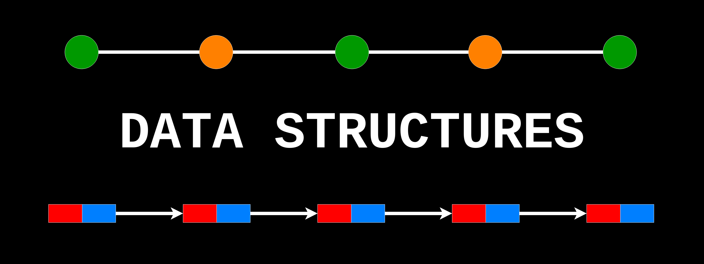

# github_id
1
    
# name
Data Structures and Algorithms Topic

# description
Students will learn data structures and algorithms through concepts such as time and space complexity,
stacks, hashtables, linked lists, trees, sorting, and more.

# image

    
# image_folder
Data-Structures-and-Algos-Topic/
    
# modules
* 1
