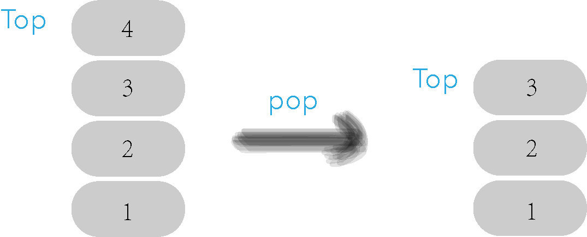

# image_folder
/Data-Structures-and-Algos-Topic/labs/Lab4_Maze_Solver_With_Stack/Cards/Images

# steps

# 1-2 Step 1

### name
Pop Function

### md_content
```
The function `pop` deletes the item on top of the stack, by decrementing the `index` , and returns the value of the item deleted.
```

### image


## 1-2 Step 2

### name
Top Function

### md_content
```
The function `top` returns the value at the top of the stack without deleting anything.
```