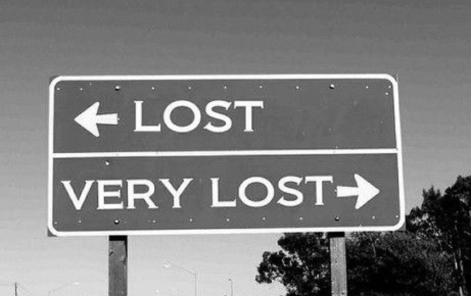

# image_folder
/Data-Structures-and-Algos-Topic/labs/Lab4_Maze_Solver_With_Stack/Cards/Images

# steps

## 4-2 Step 1

### name
Create 2 Array to see Where you have Visited

### md_content
What if all four directions turns out to be not viable, where should we go?

### image

If we are at at dead end, then we should back trace, and go out to where we came from. 

Declare two arrays `rowVisited` and `colVisited` to store the path that lead to dead ends.

Store our current row index and col index in the dead ends array, and back trace to our last location. We can use the `pop` methods in stack.

