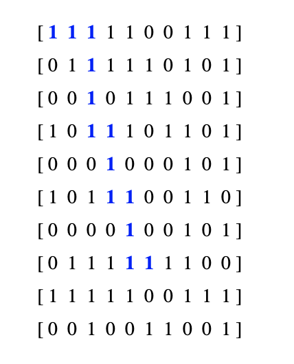

# Find the Shortest Path in a Maze

## Problem Statement - Part 3

For example, consider the below matrix. If source = (0, 0) and destination = (7, 5), the shortest path from source to destination has length 12.

 

## Analysis

Here, the problem statement


Hints:

* BFS will be a useful algorithm to familiarize yourself with

* Initialize the following two arrays in your code

  * ```python
    row = [-1, 0, 0, 1]
    col = [0, -1, 1, 0]
    ```

  * Creating `row` and `col` as such allows us to represent the four possible moves (up, left, down, and right) that one can make.

    * `row[0]` and `col[0]` taken together represent moving up.
    * `row[1]` and `col[1]` taken together represent moving left.
    * `row[2]` and `col[2]` taken together represent moving right.
    * `row[3]` and `col[3]` taken together represent moving down.L