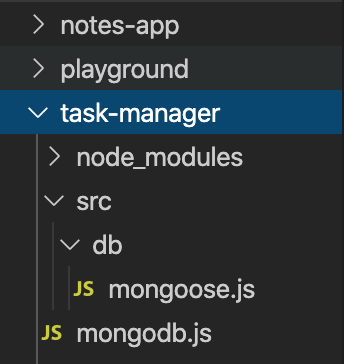

<!--title={Setting Up Local Files for Mongoose}-->

Next, after mongoose is installed, we are going to create a new directory called src. We will be storing all of our source code here, and the directory will be installed under task-manager. In src, we will be adding the folder db, which stands for database. Under here is where we create the file mongoose.js. The final file tree will look like this:

