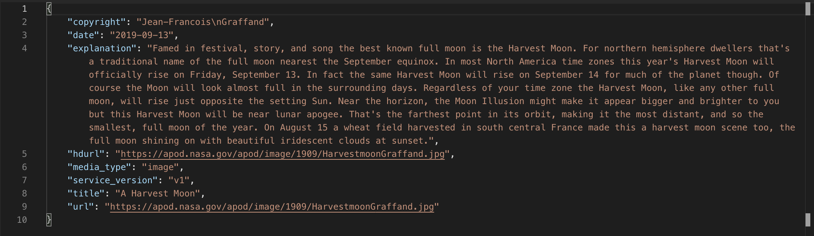

<!--title={Testing our first API call}-->

<!--badges={}-->

<!--concepts={}-->

Usually, there is a link or a small window showing what to expect once an API is called. However, for cases when there is none like now, Postman can be put to use. So, grab the API link provided and paste onto a new request on Postman with the required parameters like so:

Once send has been clicked, a JSON object should be sent back containing data sent from NASA, including the picture of the day.

It is important to **always** test out our API call first. The first reason being so that we can know the structure and the data of the API call response. By knowing both, we will be able to navigate through the object and access specific parts of it. The second reason is that by testing out the API first, we will know in full detail on <em>how</em> to use it. As explained later on, documentation is not perfect and it is only through real practice and experimentation can we fully understand the usage of the tool or language we are reading about. 

