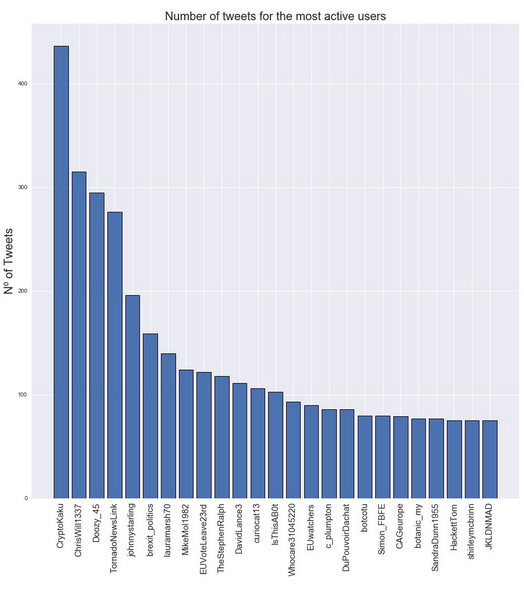

5<!--title="Plotting User Activity"-->

## Making a Bar Graph

After getting all the data set up, let's plot it. 

The following line indicates the size of our graph.

```
fig = plt.figure(figsize = (15,15))
```

The next line prepares our x-axis for the 25 top users by making evenly spaced spots for it.

```
index = np.arange(25)
```

Now lets populate the empty data holder(which represents our x-axis values) with the user names of the 25 most active users(and also add line above it to make the graph/text separation more clear). 

```
plt.bar(index, dict_values, edgecolor = 'black', linewidth=1)
```

It is also very important to label our axis so people know what they are looking at! So lets do just that:

```
plt.xlabel('Most active Users', fontsize = 18) // label for the x-axis
plt.ylabel('Nº of Tweets', fontsize=20) // label y for the x-axis
```

Now lets give our x-axis tick marks. It will allow us to analyze the data better.

```
plt.xticks(index,dict_keys, fontsize=15, rotation=90)
```

Now lets give the graph a title and save it as a image named "Tweets_of_active_users.jpg".

```
plt.title('Number of tweets for the most active users', fontsize = 20)
plt.savefig('Tweets_of_active_users.jpg')
```

Finally, lets make our graph appear for us!

```python
plt.show()
```

All of the functions are from the **matplotlib** library except arange() which is from **numpy**.

When ran, you should have something like this.



In this example plot we have here, we can see @CrytoKaku seems to have been the most active. Could he/she be a bot?