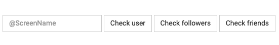

<!--title="Detecting the Bots"-->

## Botometer

Lucky us, people have already made tools for detecting twitter bots so we can check our *guesses against a source now*! And one such tool is "**Botometer**".

To check it out, we can go on the [Botometer website]( https://botometer.iuni.iu.edu/#!/). We can input twitter user names and the tool will give is its best guess on whether than user is a bot or not.

From the data you've gotten, enter the top most active user's username in the screen name bar and click check user button. Let's see if they really are a bot.

An example of what you might get would be : 

In this example, we can see the the account @TDataScience is not likely a bot while @CAGeurope has a high chance of being a bot. 

Now you know how to detect bots on Twitter!

