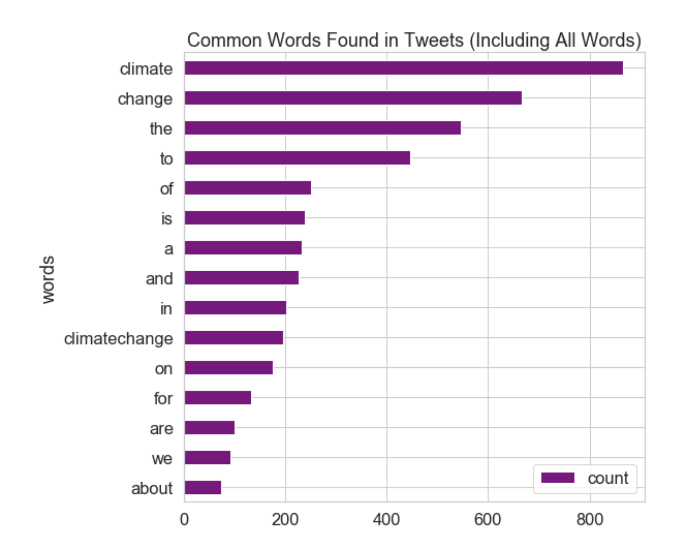

<!--title={Creating a Visualization}-->

## Creating a Visualization

Using this `Pandas Dataframe`, you can create a horizontal bar graph of the top 15 most common words in the tweets as shown below.

```python
fig, ax = plt.subplots(figsize=(8, 8))

# Plot horizontal bar graph
clean_tweets_no_urls.sort_values(by='count').plot.barh(x='words',
                      y='count',
                      ax=ax,
                      color="purple")

ax.set_title("Common Words Found in Tweets (Including All Words)")

plt.show()
```

These are simple commands and paramters that we have encountered before. The plot displays the frequency of all words in the tweets on climate change, after URLs have been removed.

With that, we are now done! Below is the output of the common words found in our Tweets.



