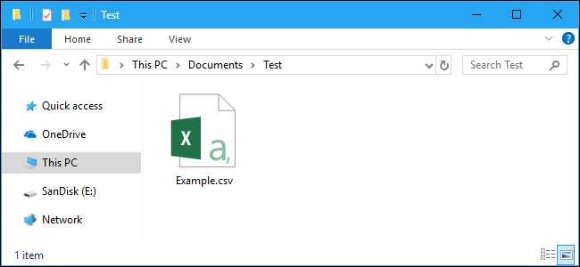

<!--title={Copying Tweets To .csv File}-->

### Step 1: Copy from a List to .cvs File

Once we have all our data we need in our `tfile` list, we copy them into a new csv file by declaring a new empty .csv file named `outfile`. To copy the data from `tfile` into the .csv file, we will use the `open()` and `writerow()` functions.

