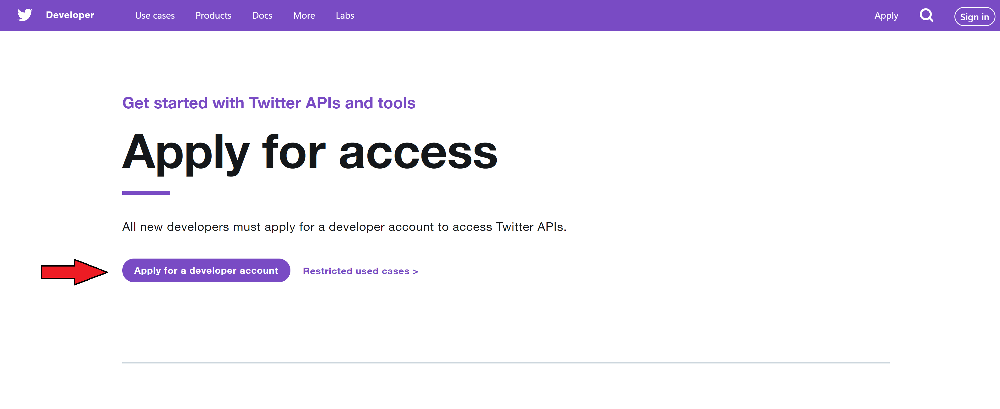

# github_id
999999

# name
Twitter Hashtag Frequency

# description
Learn how to use Twitter's API to count hashtag frequencies!

# summary
You will use Python to utilize Twitter's tweepy.

# difficulty
Hard

# image

# image_folder
Topic1/Module2_test/Activity_4/

# cards

## 1

### name
Card 1 Github

### order
2

### gems
300